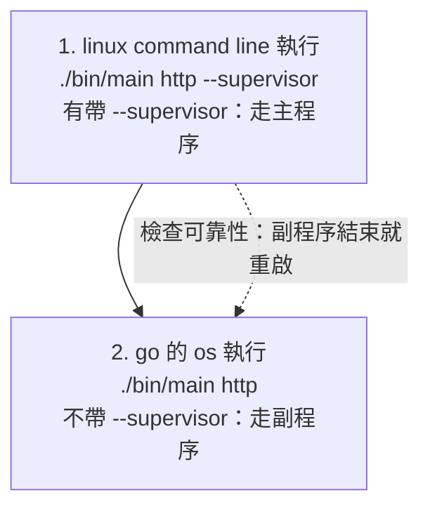

# launcher：supervisor 模式的程序流程

`http --supervisor` 不自己提供服務，而是執行「不帶 `--supervisor` 的自己」，並檢查它的可靠性：它結束就重啟。

```
go build -o bin/main ./sample/launcher
./bin/main http --supervisor [--addr :8080]
```

## 兩個程序

同一個執行檔，靠有沒有 `--supervisor` 分成兩個角色：

| 程序（linux 角度） | 命令 | 誰啟動它 | 做什麼 | 生命週期 |
| --- | --- | --- | --- | --- |
| 主程序（supervisor） | `./bin/main http --supervisor --addr :8080` | linux command line | 檢查可靠性：啟動副程序、等它結束、重啟；轉送停止訊號 | 常駐，直到收到 Ctrl-C / SIGTERM |
| 副程序（服務，實際的商務邏輯） | `./bin/main http --addr :8080` | 主程序，用 go 的 `os/exec` | 跑 gin，提供 `/ping` | 隨時可能結束（崩潰、被 kill），結束就被主程序重啟 |

## 流程

1. linux command line 執行 `./bin/main http --supervisor`：有帶 `--supervisor`，走主程序的邏輯。
2. 主程序用 go 的 `os` 執行 `./bin/main http`：不帶 `--supervisor`，走副程序的邏輯（開服務）。
3. 主程序一直盯著副程序（檢查可靠性），結束就重啟。
4. 注意 一件事情， 主程序 副程序 是在 linux 角度， 實際應用開發中 ，副程序才是我們的主要商務邏輯



## 程式邏輯（`bootstrap/launcher.go` 的 `SuperviseLauncher`）

1. 開 `for` loop，不斷的重試。
2. 主程序以 os command（`os/exec`）執行副程序（副程序才是主要商務應用）。
3. 開一個協程，用 chan `done` 接收 `oCommand.Wait()`；底下用 `for`-`select` 等待 `done`。
4. 如果 `done` 等到了（副程序死了的訊號），就等待 5 秒後再一次迴圈。

另外，`select` 同時也等停止訊號（Ctrl-C / SIGTERM）：收到就把訊號轉給副程序，然後結束，不再重啟。

```go
// SuperviseLauncher runs this executable again with args as a child, and runs it again whenever it exits,
// until this process gets SIGTERM or Ctrl-C (which is passed on to the child).
func SuperviseLauncher(args ...string) error {

	exe, err := os.Executable()
	if err != nil {
		return err
	}

	sig := make(chan os.Signal, 1)
	/*
		os.Interrupt    │ SIGINT（2）    │ 在終端機按 Ctrl-C
		syscall.SIGTERM │ SIGTERM（15）  │ kill <pid>（
	*/
	signal.Notify(sig, syscall.SIGTERM, os.Interrupt)
	defer signal.Stop(sig)

	// Step1:開 for loop,不斷的重試。
	for {
		// Step2:主程序以 os command 執行副程序(副程序才是主要商務應用)。
		oCommand := exec.Command(exe, args...)
		oCommand.Stdout = os.Stdout // 子程序的標準輸出 → 副程序自己的標準輸出
		oCommand.Stderr = os.Stderr // 子程序的標準錯誤 → 副程序自己的標準錯誤

		if err := oCommand.Start(); err != nil {
			return err
		}
		log.Printf("[supervisor] 已啟動 (pid %d)", oCommand.Process.Pid)

		// Step3:開一個協程,用 chan done 接收 oCommand.Wait();底下用 select 等待 done。
		done := make(chan error, 1)
		go func() {
			done <- oCommand.Wait()
		}()

		select {
		case <-sig:
			stopLauncher(oCommand, done)
			return nil

		case err := <-done:
			// Step4:done 等到了(副程序死了的訊號),就等待 restartWait 後再一次迴圈。
			log.Printf("[supervisor] 已結束 (%v),%s 後重啟", err, restartWait)
		}

		select {
		case <-sig:
			return nil
		case <-time.After(restartWait):
			// 等待
		}
	}
}
```

## 檔案

```
sample/launcher/
├── main.go                     → cmd.Execute()
├── cmd/
│   ├── root.go                 rootCmd，掛上 http 子命令
│   └── http/main.go            http 命令：--addr、--supervisor；決定走主程序還是副程序
├── bootstrap/launcher.go       SuperviseLauncher、stopLauncher：主程序的迴圈
└── internal/router/router.go   gin 路由（GET /ping）
```

## 驗證

```
go build -o bin/main ./sample/launcher
./bin/main http --supervisor --addr :18099 &
curl localhost:18099/ping                    # pong
pkill -9 -f "http --addr :18099$"            # 殺掉副程序
sleep 2; curl localhost:18099/ping           # 約 1 秒後重啟，又回 pong
```

```
[supervisor] 已啟動 (pid …)
[supervisor] 已結束 (signal: killed),5s 後重啟
[supervisor] 已啟動 (pid …)
```

## 注意

- 主程序是前景程序，不會自己跑到背景；要放背景請自行處理（例如 `nohup ... &`）。
- 預設的 8080 被佔用時，副程序啟動就失敗，主程序會一直重啟它（間隔越拉越長）；這時改用 `--addr`。
- Windows 沒有 SIGTERM，停止時副程序沒有機會收尾；這個我沒有在 Windows 上測過。
