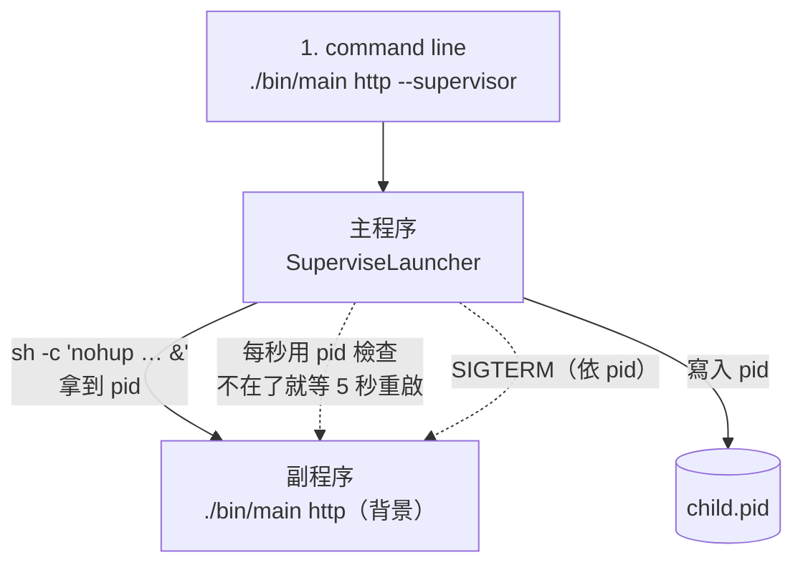

# launcher_supervisor：背景程式思維的守護（要維護 pid）

`http --supervisor` 不自己提供服務，而是把「不帶 `--supervisor` 的自己」當**背景程式**（`nohup`）啟動，把它的 pid 記在檔案裡，之後全靠 pid 檢查它還在不在：不在了就重啟。

```
cd sample/launcher_supervisor      # 自己的 go.mod（module launcher_supervise），不屬於專案根目錄的 module
go build -o bin/main .
./bin/main http --supervisor [--addr :8080]
```

## 兩個程序

同一個執行檔，靠有沒有 `--supervisor` 分成兩個角色：

| 程序（linux 角度） | 命令 | 誰啟動它 | 做什麼 | 生命週期 |
| --- | --- | --- | --- | --- |
| 主程序（supervisor） | `./bin/main http --supervisor --addr :8080` | linux command line | 用 `nohup` 啟動副程序、寫 pid 檔、每秒用 pid 檢查它還在不在、不在就 5 秒後重啟；轉送停止訊號 | 常駐，直到收到 Ctrl-C / SIGTERM |
| 副程序（服務，實際的商務邏輯） | `./bin/main http --addr :8080` | 主程序，`sh -c "nohup … &"` | 跑 gin，提供 `/ping` | 背景程式，隨時可能結束，結束就被主程序重啟 |

## 流程

1. linux command line 執行 `./bin/main http --supervisor`：有帶 `--supervisor`，走主程序的邏輯。
2. 主程序用 `nohup` 在背景執行 `./bin/main http`：不帶 `--supervisor`，走副程序的邏輯（開服務）；拿到 pid，寫進 `runtime/launcher_supervisor/child.pid`。
3. 主程序每秒用 pid 檢查副程序（`ps`），不在了就重啟。



## 程式邏輯（`bootstrap/launcher.go` 的 `SuperviseLauncher`）

1. 開 `for` loop，不斷的重試。
2. 副程序是背景程式，沒有 `Wait()` 可以等，一切靠 pid：讀 `child.pid`，那個 pid 還活著（而且是我們的執行檔）就沿用；否則以 `nohup` 啟動，把 pid 寫進 `child.pid`。
3. 每隔 1 秒用 pid（`ps -p`）檢查副程序還在不在；同時等停止訊號（Ctrl-C / SIGTERM）。
4. pid 不在了（副程序死了），就等 5 秒後再一次迴圈。

收到停止訊號時：依 pid 對副程序送 SIGTERM，最多等 5 秒，還沒結束就 SIGKILL，刪掉 `child.pid`，然後主程序自己結束。

## 為什麼要維護 pid

前景守護（見 `sample/launcher_watcher`）不需要：副程序是主程序 `Start()` 出來的，`cmd.Wait()` 就能等它，pid 在記憶體裡。

背景守護不行：副程序被丟到背景（`nohup … &`），主程序只拿到一個 pid 數字，沒有 `Wait()` 可用。之後檢查、停止都靠這個 pid；而 pid 可能過期（程式已死、pid 被別的程式重用），所以每次都要用 `ps` 確認那個 pid 的命令列還是我們的執行檔。pid 寫進檔案，主程序重啟後也能接回還活著的副程序，不會開第二個。

## 檔案

```
launcher_supervisor/
├── main.go                     → cmd.Execute()
├── cmd/
│   ├── root.go                 rootCmd，掛上 http 子命令
│   └── http/main.go            http 命令：--addr、--supervisor；決定走主程序還是副程序
├── bootstrap/launcher.go       SuperviseLauncher：主程序的迴圈、pid 檔、nohup、依 pid 停止
└── internal/router/router.go   gin 路由（GET /ping）
```

執行時產生：`runtime/launcher_supervisor/child.pid`（副程序的 pid）、`child.log`（副程序的輸出）。

## 驗證

```
go build -o bin/main .
./bin/main http --supervisor --addr :18099 &
curl localhost:18099/ping                    # pong
kill -9 $(cat runtime/launcher_supervisor/child.pid)   # 殺掉副程序
sleep 7; curl localhost:18099/ping           # 5 秒後重啟，又回 pong；child.pid 換成新的 pid
kill %1                                      # SIGTERM 主程序：副程序一起停，child.pid 被刪掉
```

```
[supervisor] 已啟動 (pid 48132)
[supervisor] pid 48132 已結束,5s 後重啟
[supervisor] 已啟動 (pid 48160)
```

`ps` 看到副程序的父程序是 1（已經脫離主程序，是真的背景程式）：

```
48132     1 ./main http --addr :18099
```

## 注意

- 只支援 macOS / Linux：用了 `nohup`、`sh`、`ps` 和 `syscall.Kill`。
- 主程序被 `kill -9`（SIGKILL）時來不及停副程序，副程序會繼續在背景跑；重新啟動主程序會依 `child.pid` 接回它，不會開第二個。
- 預設的 8080 被佔用時，副程序啟動就失敗，主程序每 5 秒重啟一次；副程序的錯誤在 `child.log`。

## 關於 守護進程的兩種策略 （一種 不用管理 pid ，一種需要 管理 pid）
1. 如果我的守護進程是 比較簡單，是 前景程式， 那我就不需要 pid 管理，因為 主程序 可以馬上從內存找到 pid
2. 如果我的守護進程是 比較智能，是 背景程式，需要 pid 管理

## docker 是什麼模式
1. docker -> 主程序 (有帶 --supervisor 的) 是 背景程式處理
2. 此時 go主程序 -> go副程序 一定只能用背景程式了，所以一定得用 pid


## 命名問題
1. 一般前景監控 叫做 foreground 或 watcher
2. 一般前景監控 叫做 background 或 supervisor