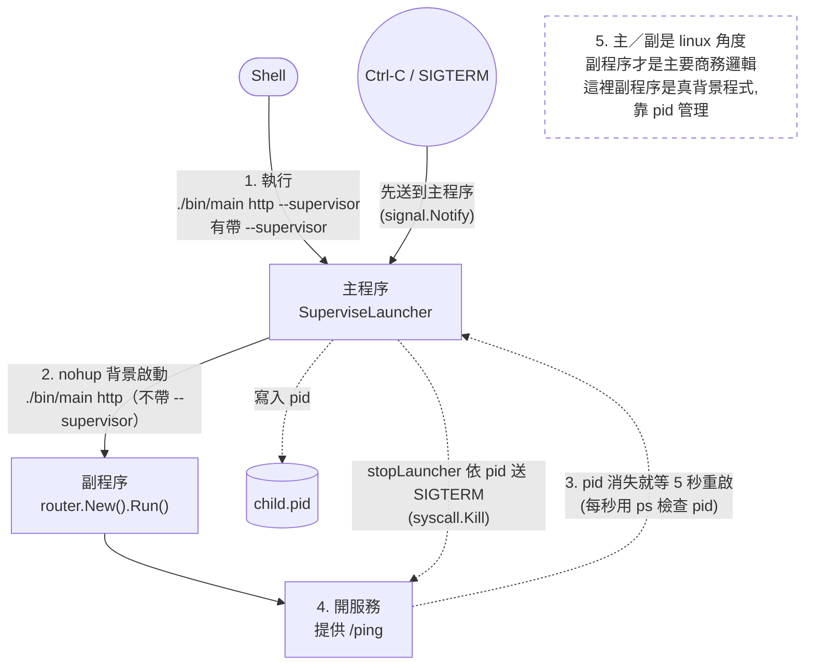

1. shell: 執行 `./bin/main http --supervisor`：有帶 `--supervisor`，走主程序的邏輯。
2. go 主程序: 用 `nohup` 在背景執行 `./bin/main http`：不帶 `--supervisor`，運行副程序的邏輯；把 pid 寫進 pid 檔。
3. go 主程序: 副程序是背景程式，沒有 `Wait()` 可用，改成每秒用 pid 檢查它還在不在，不在了就等 5 秒重啟。
4. go 副程序: 開服務
5. 注意 一件事情， 主程序 副程序 是在 linux 角度， 實際應用開發中 ，副程序才是我們的主要商務邏輯；跟 `launcher_watcher` 不同的是，副程序在這裡是真正的背景程式（父程序是 1），主程序全靠 pid 管理它，不是靠子程序關係。

