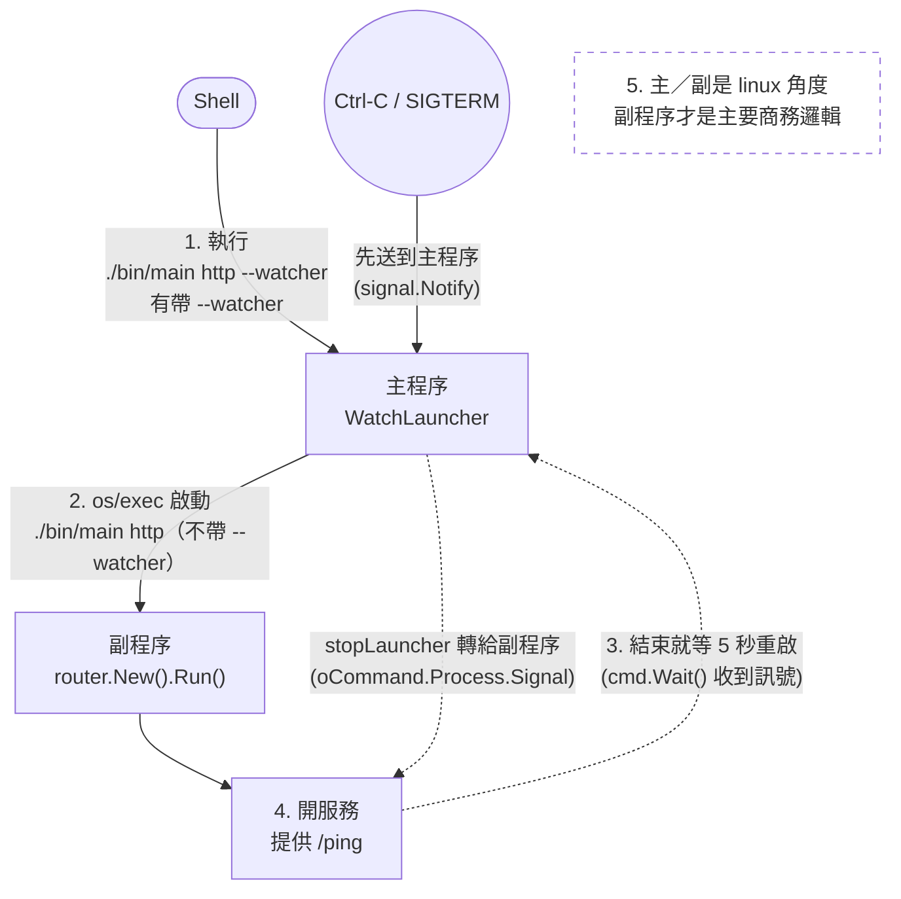

1. shell: 執行 `./bin/main http --watcher`：有帶 `--watcher`，走主程序的邏輯。
2. go 主程序: `os` 執行 `./bin/main http`：不帶 `--watcher`，運行副程序的邏輯。
3. go 主程序: 一直盯著副程序（檢查可靠性），結束就重啟。
4. go 副程序: 開服務
5. 注意 一件事情， 主程序 副程序 是在 linux 角度， 實際應用開發中 ，副程序才是我們的主要商務邏輯

