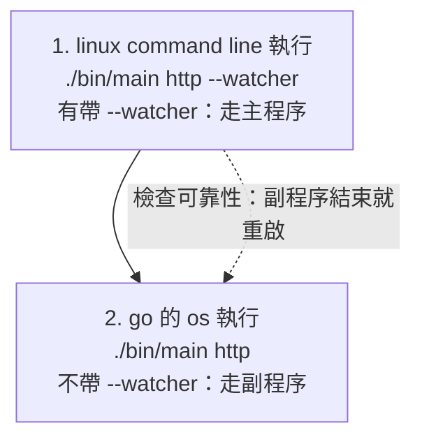

# launcher：supervisor 模式的程序流程

`http --watcher` 不自己提供服務，而是執行「不帶 `--watcher` 的自己」，並檢查它的可靠性：它結束就重啟。

```
cd sample/launcher_supervise      # 自己的 go.mod（module launcher_supervise），不屬於專案根目錄的 module
go build -o bin/main .
./bin/main http --watcher [--addr :8080]
```

## 兩個程序

同一個執行檔，靠有沒有 `--watcher` 分成兩個角色：

| 程序（linux 角度） | 命令 | 誰啟動它 | 做什麼 | 生命週期 |
| --- | --- | --- | --- | --- |
| 主程序（supervisor） | `./bin/main http --watcher --addr :8080` | linux command line | 檢查可靠性：啟動副程序、等它結束、重啟；轉送停止訊號 | 常駐，直到收到 Ctrl-C / SIGTERM |
| 副程序（服務，實際的商務邏輯） | `./bin/main http --addr :8080` | 主程序，用 go 的 `os/exec` | 跑 gin，提供 `/ping` | 隨時可能結束（崩潰、被 kill），結束就被主程序重啟 |

## 流程

1. linux command line 執行 `./bin/main http --watcher`：有帶 `--watcher`，走主程序的邏輯。
2. 主程序用 go 的 `os` 執行 `./bin/main http`：不帶 `--watcher`，走副程序的邏輯（開服務）。
3. 主程序一直盯著副程序（檢查可靠性），結束就重啟。
4. 注意 一件事情， 主程序 副程序 是在 linux 角度， 實際應用開發中 ，副程序才是我們的主要商務邏輯




## 檔案

```
launcher_supervise/
├── main.go                     → cmd.Execute()
├── cmd/
│   ├── root.go                 rootCmd，掛上 http 子命令
│   └── http/main.go            http 命令：--addr、--watcher；決定走主程序還是副程序
├── bootstrap/launcher.go       WatchLauncher、stopLauncher：主程序的迴圈
└── internal/router/router.go   gin 路由（GET /ping）
```

## 驗證

```
go build -o bin/main .
./bin/main http --watcher --addr :18099 &
curl localhost:18099/ping                    # pong
pkill -9 -f "http --addr :18099$"            # 殺掉副程序
sleep 2; curl localhost:18099/ping           # 約 1 秒後重啟，又回 pong
```

```
[supervisor] 已啟動 (pid …)
[supervisor] 已結束 (signal: killed),5s 後重啟
[supervisor] 已啟動 (pid …)
```

## 注意

- 主程序是前景程序，不會自己跑到背景；要放背景請自行處理（例如 `nohup ... &`）。
- 預設的 8080 被佔用時，副程序啟動就失敗，主程序會一直重啟它（間隔越拉越長）；這時改用 `--addr`。
- Windows 沒有 SIGTERM，停止時副程序沒有機會收尾；這個我沒有在 Windows 上測過。

## 關於 守護進程的兩種策略 （一種 不用管理 pid ，一種需要 管理 pid）
1. 如果我的守護進程是 比較簡單，是 前景程式， 那我就不需要 pid 管理，因為 主程序 可以馬上從內存找到 pid
2. 如果我的守護進程是 比較智能，是 背景程式，需要 pid 管理

## docker 是什麼模式
1. docker -> 主程序 (有帶 --watcher 的) 是 背景程式處理
2. 此時 go主程序 -> go副程序 一定只能用背景程式了，所以一定得用 pid